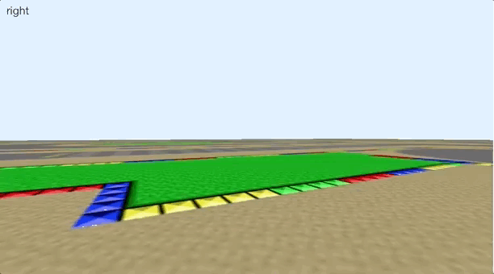

## Getting Started

Clone this GitHub repo and open the package project in RStudio, then launch this 
simulation as follows, you can turn left and right using your arroy keys:

```{r eval=FALSE}
library(hexkart)
hexkart_play()
```


To capture a kart session simply run:

```{r eval=FALSE}
hexkart_capture()
```

This will create a snapshot under `capture/` with labels: `###-left.png`,
`###-forward.png` or `###-right.png` that you can use for training. Once trained,
you can use `hexkart_control()` to feed predictions back. We can feed a random
direction by running:

```{r eval=F}
labels <- c("left", "forward", "right")
hexkart::hexkart_control(function(image, direction) {
  sample(labels, 1)
})
```

## Training using TensorFlow

While `hexkart` is completely unrelated to `tensorflow` and can be used to capture
and train a model using any package; this writeup explores using `tensorflow`,
`keras`, `cloudml` and `tfdeploy` for training.

First we need to run `hexkart_capture()` to capture some training data. Then, we
will first try modeling this as an image classification problem using the
[cifar10_cnn](https://tensorflow.rstudio.com/keras/articles/examples/cifar10_cnn.html)
Keras example.

```{r eval=FALSE}
tfruns::training_run("models/tf-cifar.R")
```

or in `cloudml` runnning:

```{r eval=FALSE}
cloudml::cloudml_train("models/tf-cifar")
```

use `tfdeploy` to validate that predictions over the trained model work by running:

```{r eval=F}
tfdeploy::predict_savedmodel(array(0, c(32,32,3)))
```
```
$predictions
                  output
1 0.3322, 0.3316, 0.3363
```

Notice that `predict_savedmodel()` initializes a tensorflow session for each
prediction, which takes too long:

```{r eval=F}
system.time(tfdeploy::predict_savedmodel(array(0, c(32,32,3))))
```
```
   user  system elapsed 
  2.007   0.045   2.027 
```

Instead, we can preload the model and predict over a `graph` object as follows:

```{r eval=F}
sess <- tensorflow::tf$Session()
graph <- tfdeploy::load_savedmodel(sess)

system.time(tfdeploy::predict_savedmodel(array(0, c(32,32,3)), graph, type = "graph", sess = sess))
```
```
   user  system elapsed 
  0.027   0.001   0.025
```

Which we can use to control the kart based on this model:

```{r eval=F}
hexkart::hexkart_control(function(image, direction) {
  labels <- c("left", "forward", "right")
  input <- array(png::readPNG(image), c(32,32,3))
  result <- tfdeploy::predict_savedmodel(input, graph, type = "graph", sess = sess)
  scores <- result$predictions$activation[[1]]

  labels[which(scores == max(scores))]
})
```

As we can see bellow, using the CIFAR CNN example is not up to the task, yet:


